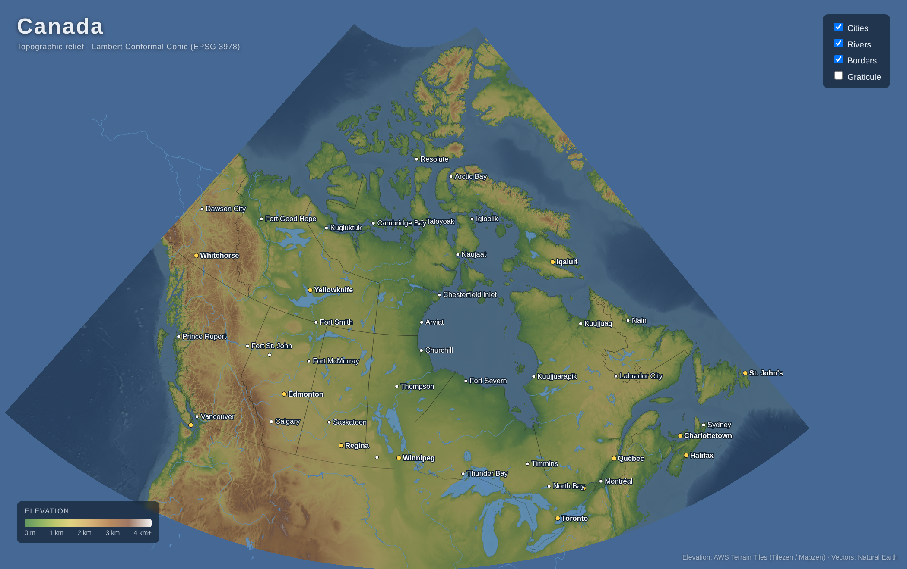

# Canada - Geographically Accurate Topographic Map

An interactive, geographically accurate topographic map of Canada, rendered in
the browser using the official **Canada Atlas Lambert Conformal Conic**
projection (EPSG:3978 - standard parallels 49°N & 77°N, central meridian 95°W).



## Quick start

The map is pre-built, so you can serve it immediately:

```bash
pip install -r requirements.txt   # only needed to (re)build the data
python -m http.server 8000        # then open http://localhost:8000
```

## What it shows

- **Topographic relief** - real elevation, hillshaded and hypsometrically
  tinted (lowland greens → highland browns → snow-capped peaks; ocean depth
  shading).
- **Provinces & territories**, coastline, major **lakes** and **rivers**.
- **Cities** with de-cluttered labels; provincial/territorial capitals in gold.
- Toggles for cities, rivers, borders, and a graticule; hover for tooltips.

The relief raster is reprojected pixel-by-pixel from equirectangular lon/lat
into the Lambert Conformal Conic projection so it registers exactly with the
vector overlays.

## Rebuilding the data

`data/` and `vendor/` are committed so the site works out of the box. To
regenerate everything from source:

```bash
pip install -r requirements.txt
python build_data.py          # set TOPO_ZOOM=6 for higher-res relief (slower)
```

This downloads and processes:

- **Elevation** - [AWS Terrain Tiles](https://registry.opendata.aws/terrain-tiles/)
  (Terrarium RGB encoding; Tilezen / Mapzen, public-domain data mix).
- **Vector features** - [Natural Earth](https://www.naturalearthdata.com/)
  1:50m admin boundaries, lakes, rivers, and populated places (public domain).

`build_data.py` also vendors d3 locally (from the npm registry) so the page
runs fully offline.

## Files

| Path | Purpose |
|------|---------|
| `build_data.py` | Fetches elevation + vectors, builds the relief raster and GeoJSON |
| `index.html` / `style.css` / `main.js` | The static map application |
| `data/` | Generated assets: `relief.png`, GeoJSON layers, bounds metadata |
| `vendor/d3.v7.min.js` | Vendored d3 (offline) |
